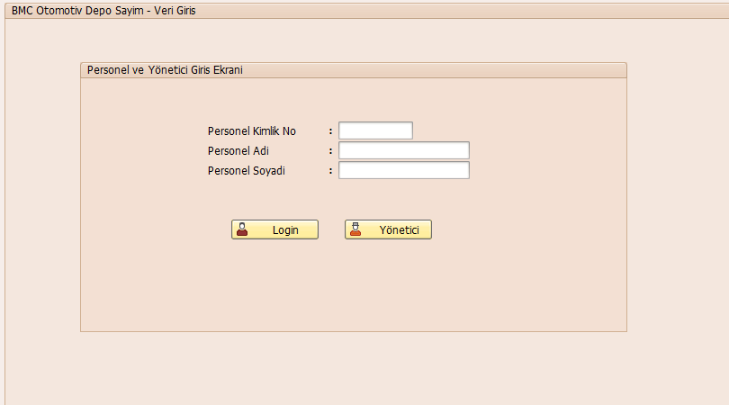
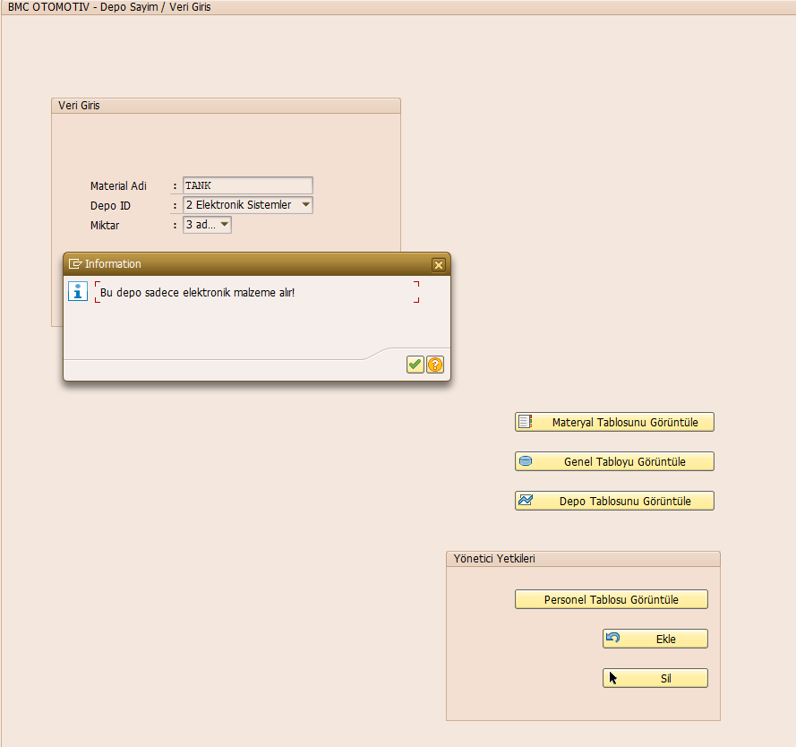
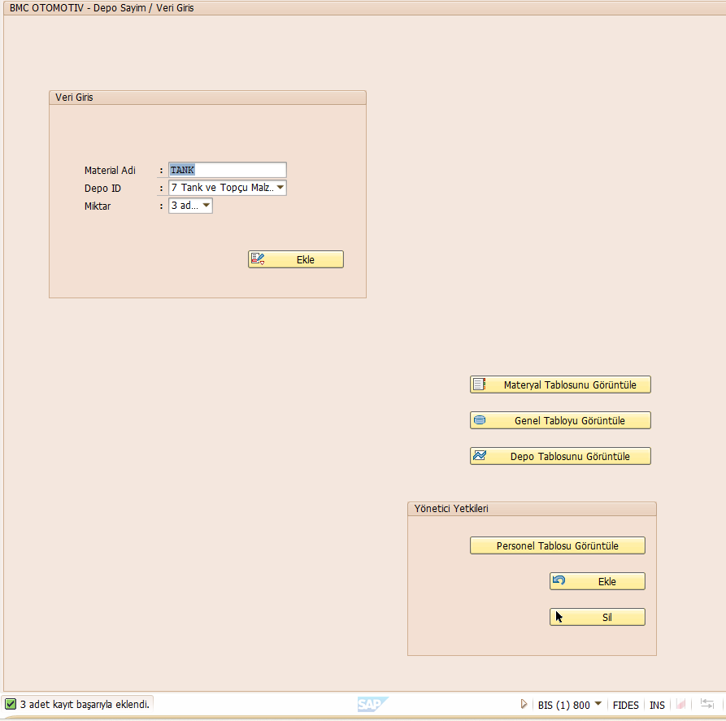
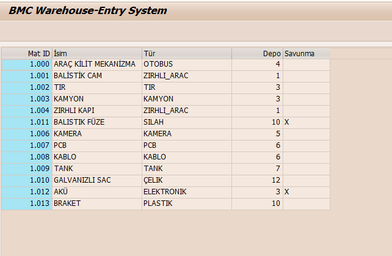
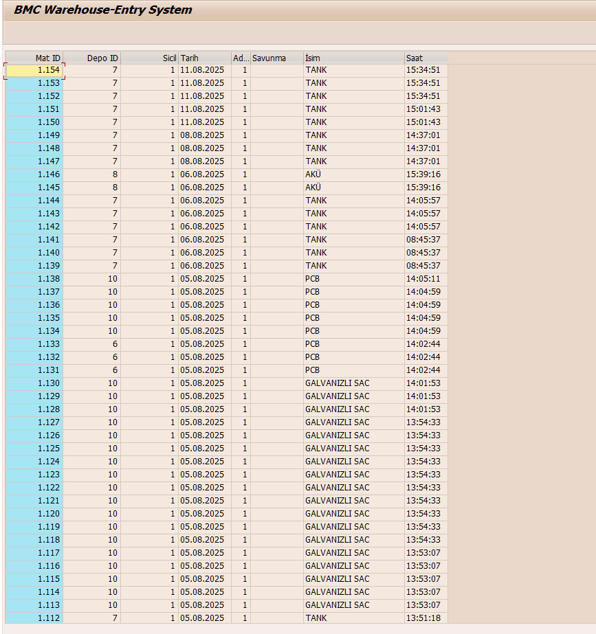
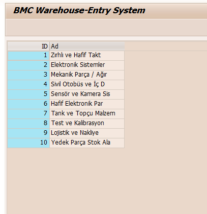
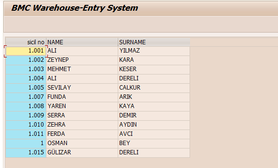
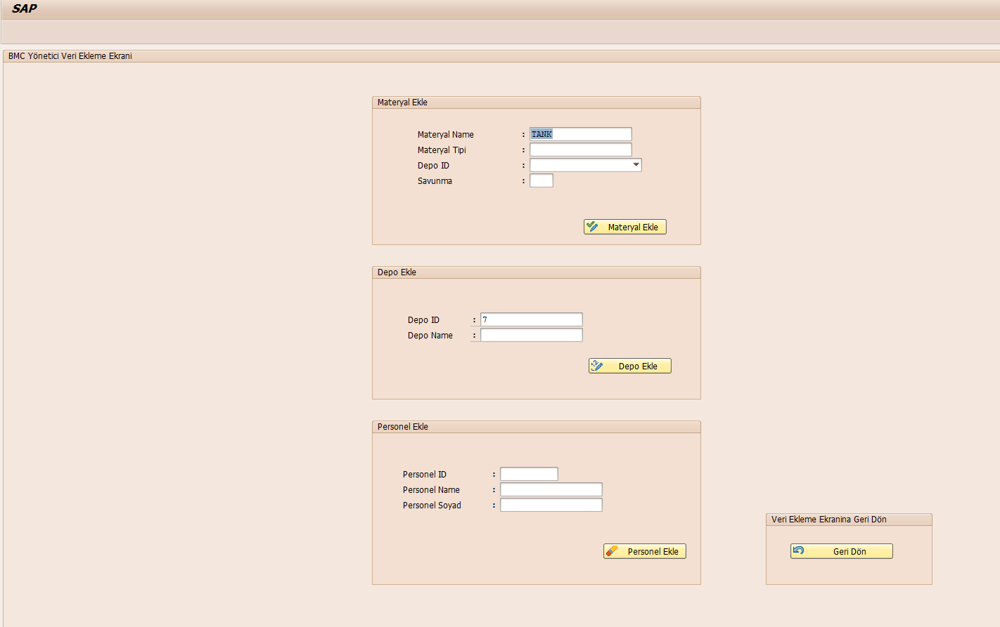
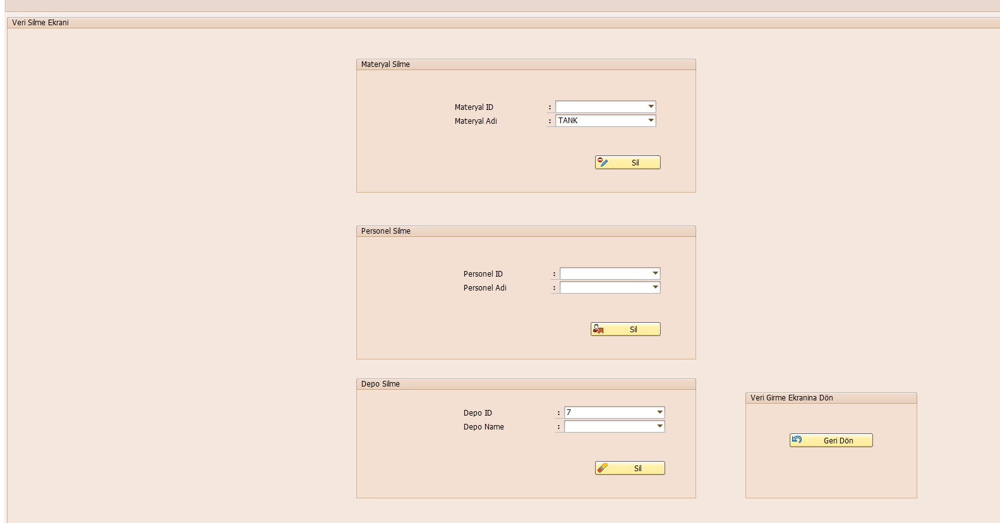
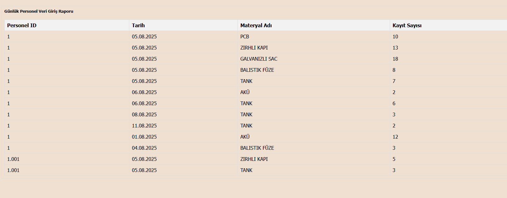

# BMC Warehouse Entry System

This is an SAP ABAP-based warehouse entry and management system developed for **BMC Automotive**.  
The project enables personnel and administrators to manage materials, warehouses, and personnel records efficiently, with role-based access and automated email reporting.

---

## 🚀 Features

- **Login System**
  - Separate login for Personnel and Administrator.
  - Role-based access to functions.

- **Material Management**
  - Add, view, and delete materials.
  - Automatic Material ID generation.

- **Warehouse Management**
  - Add, view, and delete warehouse records.

- **Personnel Management**
  - Add, view, and delete personnel records.

- **Data Entry**
  - Personnel can record incoming materials into the warehouse.
  - Validation rules to ensure materials are assigned only to suitable warehouses.

- **ALV Grid Display**
  - Material table
  - Warehouse table
  - Personnel table
  - Master data table

- **Automated Reporting**
  - Generates a daily material entry report per personnel.
  - Sends the report via email in HTML format.

---

## 📸 Screenshots

### Login Screen

### Data Entry Screen - Validation Example

### Data Entry Screen - Successful Entry

### Material Table View

### Master Table View

### Warehouse Table View

### Personnel Table View

### Administrator Add Data Screen

### Delete Data Screen

### Content of the report sent via email

---

## 📧 Automated Email Report
The system automatically compiles daily data entry information for each personnel and sends it as an HTML table via email.

---

## 🛠 Technologies Used
- **SAP ABAP**
- **ALV Grid (CL_SALV_TABLE)**
- **VRM Listbox Population**
- **BCS Email Sending Classes**

---

## 📄 License
This project was developed during an internship at BMC Automotive for educational and training purposes. Redistribution without permission is prohibited.

